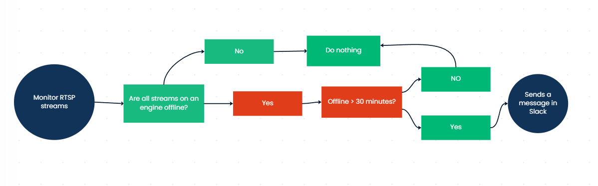

# NVIDIA DeepStream Engine Health Monitor

This project is a cloud-deployed Python system that monitors camera streams via RTSP and alerts Slack when all cameras on a DeepStream engine goes offline for over 30 minutes.

## Features

- Monitors RTSP streams grouped by DeepStream engine
- Detects when all cameras in a group are offline
- Sends Slack alerts **only** if the engine was previously online and remains down for 30+ minutes
- Automatically deployed and run on Railway from GitHub
- Configurable via `.env` and JSON camera list

## Architecture Diagram

## Stack used

- **Python**
  - `opencv-python-headless` for stream health checks
  - `requests` for Slack webhooks
  - `dotenv` for environment management
- **GitHub** for version control
- **Railway** for cloud deployment
- **Slack** for real-time alerts

## How It Works

-The script loads a JSON file defining RTSP camera URLs, each grouped under a specific engine label.
-At a fixed interval (default: every 60 seconds), it checks each stream's availability.
-If all cameras under one engine group are offline:
    -The system logs the downtime.
-If the group remains offline for 30+ continuous minutes, and was previously online, a Slack alert is sent.
-Once any camera in the group comes back online, the timer and alert state for that engine are reset.

